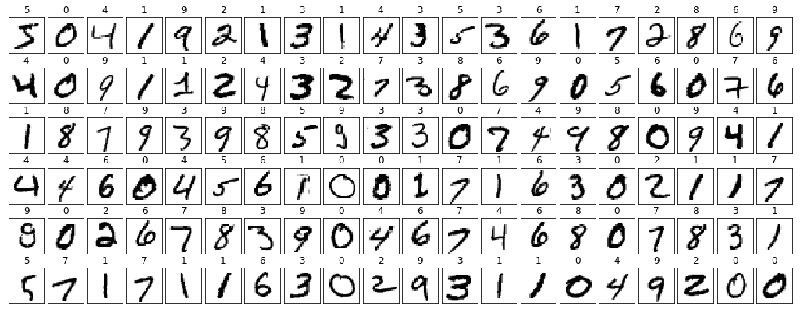

# TL;DR

Do this:
1. Click the Launch button above. In the new page that opens click the "Import" button to import the notebook.
2. Run [start.ipynb](start.ipynb) to learn about ML and PyTorch
3. Run [cloud.ipynb](cloud.ipynb) to learn about AzureML service
4. (other things)
5. Become a multi-millionaire AI startup founder

Add an issue to the repo if something doesn't work so I can 
fix it!

# Machine Learning Quickstart
The purpose of this brief tutorial is to get you oriented
on the Machine Learning Process. Machine Learning (ML) is
basically a different way of creating "code" or something
that is executed much in the same way code is executed. The
primary difference is that machine learning has set classes
of execution paths (usually called models) that have fixed
parameters that need to be "learned." For supervised learning
these parameters are optimized by giving ML algorithms examples
of the inputs and answers. The process usually proceeds as follows:

1. Start with a question
2. Find relevant data
3. Select appropriate items from the data
4. Choose a model type
5. Optimize the model parameters
6. Save model
7. Put model into production

The notebooks presented in this repo are divided into two
overlpping sections:

- Problem, Data, Experimentation - Local
- Large Scale Experimentation, Deployment - Cloud

# Local
The [starting notebook](start.ipynb) shows the local approach
to the Machine Learning Process. In this notebook you will
find the first 5 steps outlined above but on a smaller scale
(in this case the problem is small as is - generally for larger
problems we begin on a small scale and then once some of the
hypothesis are proved we move to large scale).

# Cloud
The [cloud notebook](cloud.ipynb) shows what a large scale
approach would be using Azure Machine Learning service and
covers steps 4-7 outlined above. In this case the dataset
size has not changed at all and can be run locally without
problem but you can imagine a scenario where we test out
our thoughts on a small subset of all available data locally
and then move to cloud scale when testing our hypothesis' on
the full dataset.

# Problem
Because I am more interested that you learn the process I decided
to go with the "Hello World" of Machine Learning: **predicting 
digits**.

Basically, given a 28x28 pixel grayscale image, can you predict
the actual handwritten number? Mathematically speaking, given 
a 784 sized vector of numbers between 0-255, can you return the 
corresponding digit?

# Questions and/or Suggestions
If there is any part of this that is hard to understand please
add an issue to the repo! Would love to make this super easy to
understand. My personal opinion is that everyone can understand
the rudiments of what is happening!

